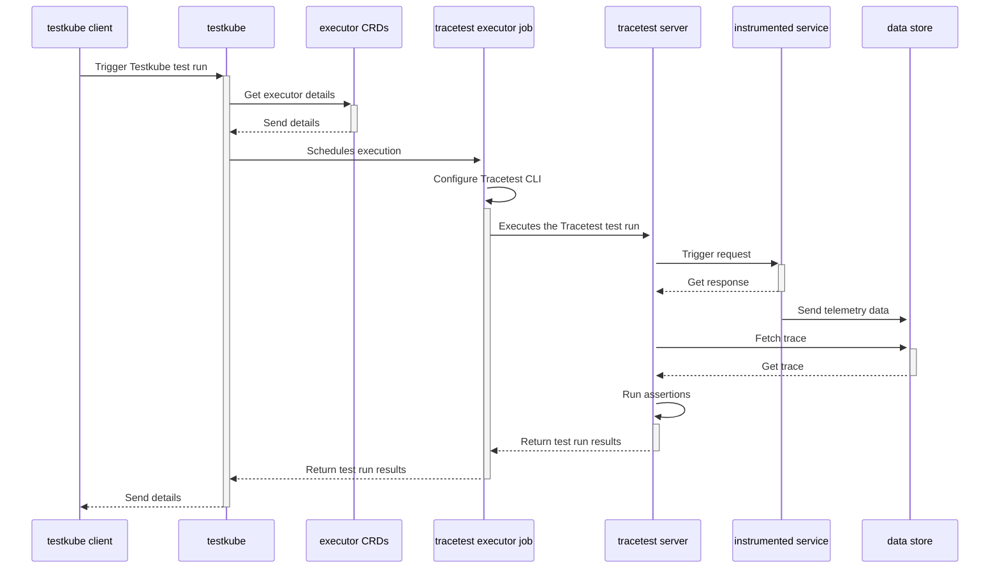

# Welcome to TestKube Tracetest Executor

TestKube Tracetest Executor is a test executor to run [Tracetest](https://tracetest.io/) tests with [TestKube](https://testkube.io).

# Running Tracetest with Testkube

[Tracetest](https://tracetest.io/) is a testing tool based on [OpenTelemetry](https://opentelemetry.io/) that allows you to test your distributed application. It allows you to use your telemetry data generated by the OpenTelemetry tools to check and assert if your application has the desired behavior defined by your test definitions.

## Prerequisites

- **Trecetest Server:** You'll need a running instance of Tracetest which is going to be executing your tests and assertions. To do so you can follow the instructions defined in the Tracetest [documentation](https://docs.tracetest.io/deployment/kubernetes).

- **OpenTelemetry Instrumented Service:** In order to generate traces and spans, the service under test must support the basics for [propagation](https://opentelemetry.io/docs/reference/specification/context/api-propagators/) through HTTP requests, and also store traces and spans into a Data Store Backend (Jaeger, Grafana Tempo, OpenSearch, etc) or use the [OpenTelemetry Collector](https://docs.tracetest.io/configuration/overview#using-tracetest-without-a-trace-data-store).

## 1. Deploying the Tracetest Executor

First you need to register and deploy the Tracetest executor in your cluster using the Testkube CLI:

```bash
kubectl testkube create executor --image kubeshop/testkube-executor-tracetest:latest --types "tracetest/test" --name tracetest-executor
```

## 2. Creating and running your test

Now you need a Tracetest test. Have a look at the [Tracetest documentation](https://docs.tracetest.io/cli/creating-tests) for details on writing tests. Here is a simple test definition example:

```yaml
type: Test
spec:
  id: R5NITR14g
  name: Pokeshop - List
  description: Get a Pokemon
  trigger:
    type: http
    httpRequest:
      url: http://demo-pokemon-api.demo/pokemon?take=20&skip=0
      method: GET
      headers:
        - key: Content-Type
          value: application/json
  specs:
    - selector: span[tracetest.span.type="http"]
      assertions:
        - attr:http.method = "GET"
    - selector: span[tracetest.span.type="database"]
      assertions:
        - attr:db.name = "pokeshop"
```

Execute the following command to create the test executor object in Testkube. Do not forget to provide the path to your Tracetest definition file using the `--file` argument, and also the Tracetest Server endpoint using the `TRACETEST_ENDPOINT` `--variable`:

```bash
kubectl testkube create test --file my/file/location.yaml --type "tracetest/test" --name pokeshop-tracetest-test --variable TRACETEST_ENDPOINT=http://tracetest
```

Finally you can run the test:

```bash
kubectl testkube run test --watch pokeshop-tracetest-test
```

# Architecture



# Issues and enchancements

Please follow the main [TestKube repository](https://github.com/kubeshop/testkube) for reporting any [issues](https://github.com/kubeshop/testkube/issues) or [discussions](https://github.com/kubeshop/testkube/discussions)

# Testkube

For more info go to [main testkube repo](https://github.com/kubeshop/testkube)

 [](https://github.com/kubeshop/testkube/tags?label=Downloads) 

  


#### [Documentation](https://kubeshop.github.io/testkube) | [Discord](https://discord.gg/hfq44wtR6Q)

# Tracetest

For more info go to [main tracetest repo](https://github.com/kubeshop/tracetest)


#### [Documentation](https://docs.tracetest.io/) | [Discord](https://discord.gg/6zupCZFQbe)
